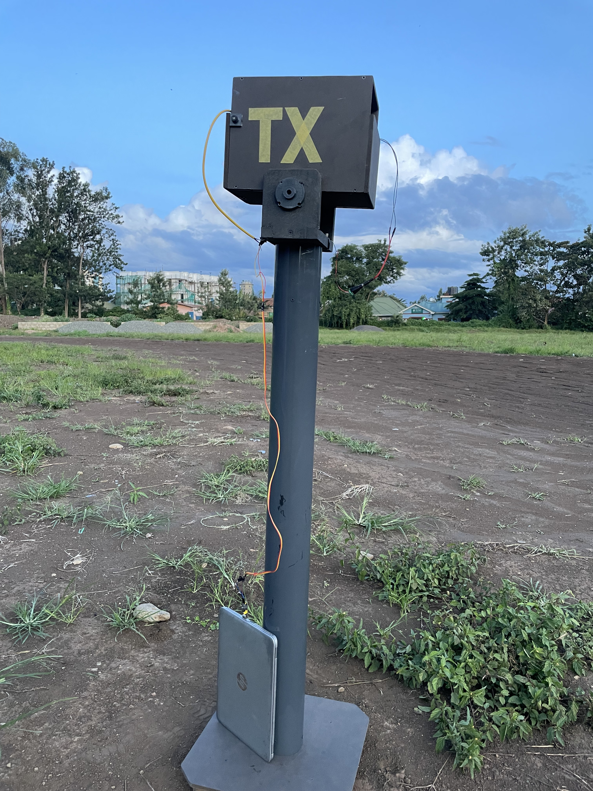
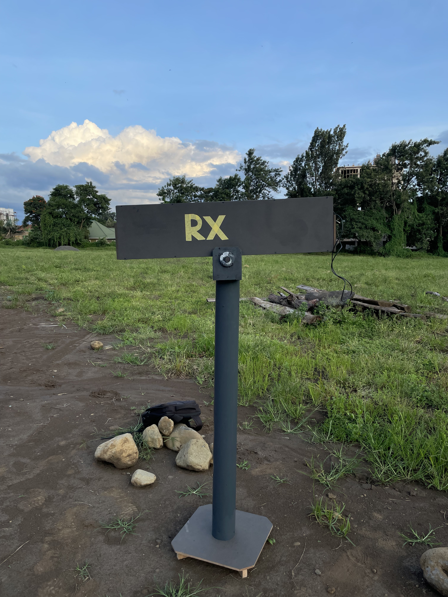
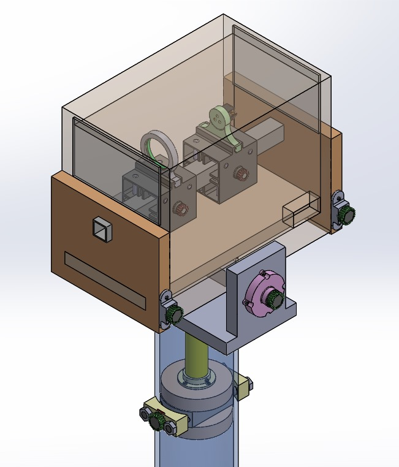
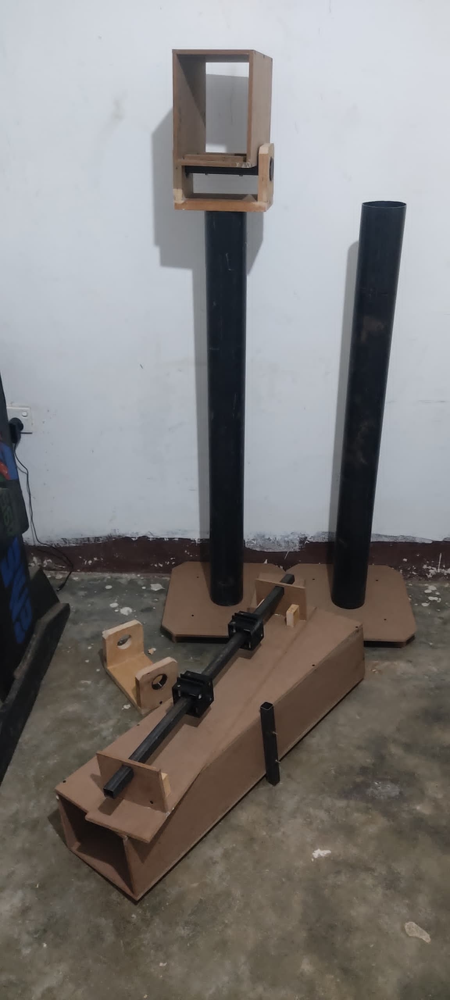
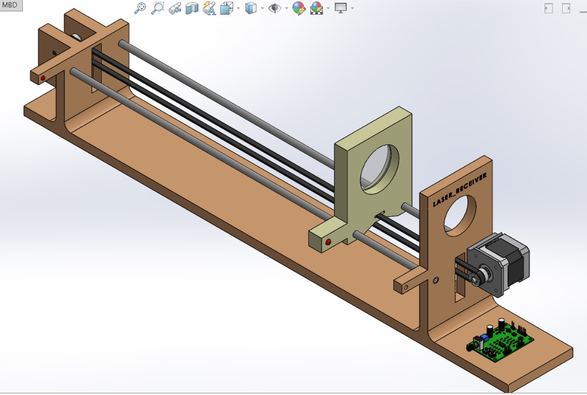
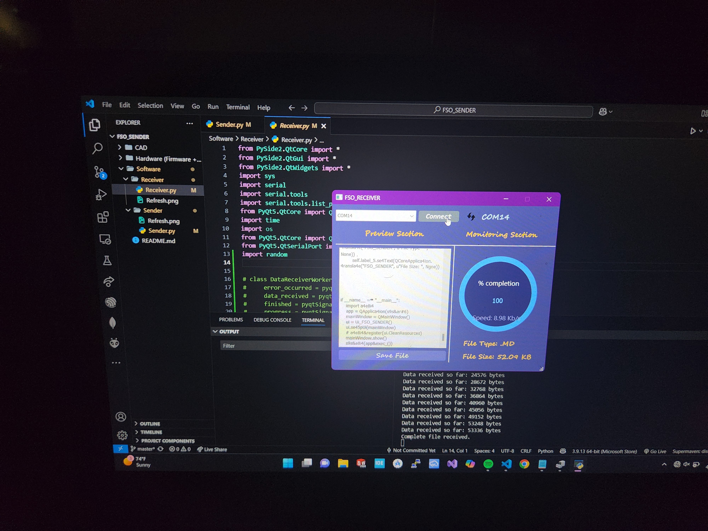
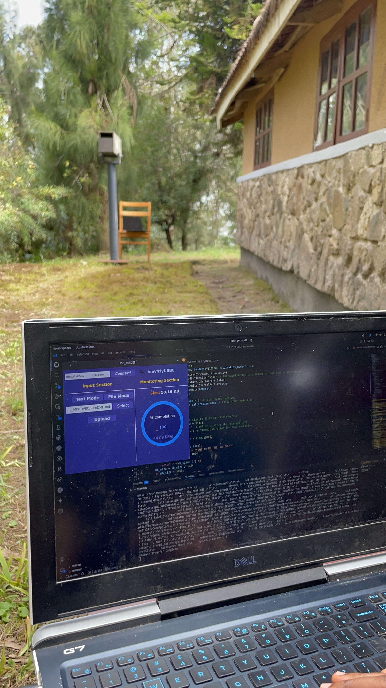
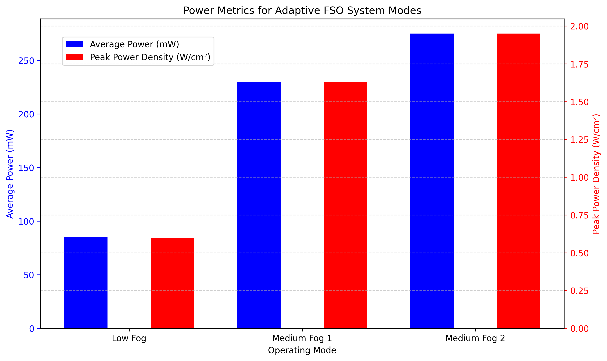
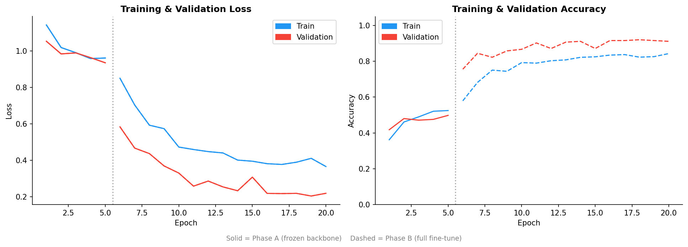

# FSO - Free Space Optics Communication System

A fully working wireless optical link built from off-the-shelf components for under $330. Custom circuits, fabricated hardware, desktop software, and an AI-driven adaptive power controller - designed, built, and field-tested by two Mechatronics students in Tanzania.

---

## The Problem

Laying fiber or cellular infrastructure in rural Tanzania is expensive and often logistically impossible. Yet connectivity demand is growing - for communities, drone applications, and satellite ground links. Commercial FSO systems exist but are priced far out of reach for most local use cases.

We wanted to answer one question: how far can careful engineering with minimal budget take you?

---

## What We Built

A complete FSO link - transmitter, receiver, alignment system, desktop software, and an adaptive power controller - all designed and fabricated from scratch.

| Layer | What |
|---|---|
| Optical | 650 nm off-shelf laser diode, custom fast-switching TX circuit |
| Receiver | Custom transimpedance amplifier (TIA), USB-to-serial interface |
| Alignment | CAD-designed frames, fabricated in-house from wood and PVC |
| Software | PyQt5 desktop app - file transfer, one-way chat, packet monitoring |
| Power control | Raspberry Pi + fog classifier + ATmega328P GPIO switching |

---

## Hardware

The transmitter drives a 650 nm laser diode through a custom fast-switching circuit designed for the modulation speeds needed for serial data. On the receiver end, a custom TIA converts the optical signal back to voltage, feeding a USB-to-serial converter that connects to the desktop application.

Maintaining line-of-sight is the hardest physical challenge in any FSO link. We designed alignment frames in CAD and fabricated them in-house.

 

| | |
|:---:|:---:|
|  |  |
| Transmitter (TX) | Receiver (RX) |

<table>
  <tr>
    <td align="center" width="50%">
       
      <em>CAD - TX enclosure</em>
    </td>
    <td align="center" rowspan="2" width="50%">
       
      <em>Fabricated prototypes</em>
    </td>
  </tr>
  <tr>
    <td align="center">
       
      <em>CAD - RX alignment system</em>
    </td>
  </tr>
</table>

Schematics and bill of materials are in [`Hardware/`](Hardware/).

---

## Software

A desktop application on both ends of the link handles the full communication stack - serial connection management, file transfer (any file type), one-way text messaging, and live monitoring of transfer progress, speed, and missed packets.

 

*Receiver app - 100% completion, file type and size confirmed.*

*Sender application running during outdoor field test.*

---

## Adaptive Power Control

Running the laser at full power continuously wastes energy - in clear conditions the link simply doesn't need it. We added a second layer: a Raspberry Pi runs a MobileNetV2 fog classifier (ONNX, edge-deployed) fused with live OpenWeatherMap visibility data. It outputs one of three states - CLEAR, MEDIUM_FOG, HEAVY_FOG - and an ATmega328P translates that into 2-bit GPIO control over the transmitter power.

The system only pushes full power when conditions actually demand it.

To test this under real fog, we traveled to Morogoro - the highland areas there gave us consistent fog cover we couldn't get at home.

 

*Morogoro highlands - test environment for fog condition validation.*

*Adaptive power output across fog conditions - power scales with visibility.*

The classifier code is in [`Classifier/`](Classifier/).

### Model Training

The fog classifier is MobileNetV2 fine-tuned in two phases on RESIDE-SOTS and DAWN fog datasets — first with a frozen backbone (head only), then fully fine-tuned. Trained on Kaggle using PyTorch, exported to ONNX for edge deployment on the Pi.

*Loss drops sharply after Phase B (full fine-tune) begins at epoch 5. Validation accuracy reaches ~91%.*

---

## Timeline

| Period | Milestone |
|---|---|
| Apr 2025 | Project started - research, component sourcing, circuit design |
| May – Aug 2025 | Hardware fabrication, alignment frames, first link established |
| Sep – Nov 2025 | Software development, open-field testing |
| Dec 2025 | Adaptive power system integrated |
| Jan – Feb 2026 | Morogoro fog testing, full system validation |

---

## Team

Two Mechatronics & Materials students, built outside class hours.

The goal was never to compete with commercial FSO systems. It was to understand what's actually possible with low cost and off-the-shelf parts - and to start building a path toward affordable optical links that could be deployed in rural Tanzania, on drones, or as part of satellite ground infrastructure.
